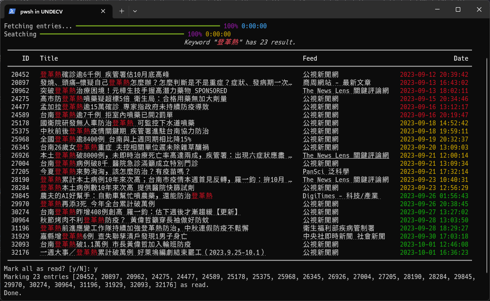

# Minitopic

Search and mark as read for Miniflux.



## How to use

1. Create `config.py` and set `base_url` and `api_key`.
2. Use the command.

```plain
Usage: minitopic.py [OPTIONS] KEYWORD

  Search and mark as read for Miniflux.

Options:
  -b, --batch-size INTEGER RANGE  The number of entries retrieved each time. [default: 1000; x>=100]
  -d, --dryrun                    Dryrun.
  -f, --force-fetch               Force fetching from the API regardless of cache expiration.
  -h, --help                      Show this message and exit.
```
